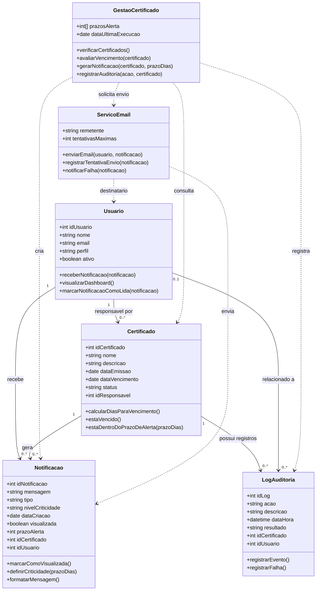
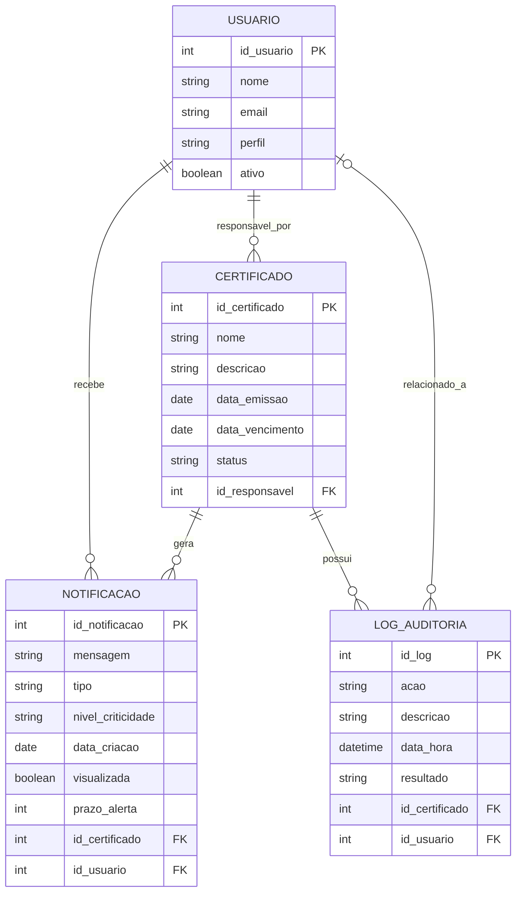

## Sprint 2: Modelagem de Classes e Relacionamentos

## 1. Resumo

Nesta parte foi montado o modelo de classes para a funcionalidade de **alertas automáticos de vencimento de certificados**.

O sistema precisa consultar os certificados cadastrados, verificar os prazos de vencimento, gerar notificações para os responsáveis e guardar os registros principais em log de auditoria.

## 2. Classes do Modelo

### `Certificado`
* **Responsabilidade:** Guardar os dados do certificado cadastrado, como identificação, validade e situação.
* **Principais atributos:**
  * `idCertificado`
  * `nome`
  * `descricao`
  * `dataEmissao`
  * `dataVencimento`
  * `status`
  * `idResponsavel`
* **Principais métodos:**
  * `calcularDiasParaVencimento()`
  * `estaVencido()`
  * `estaDentroDoPrazoDeAlerta(prazoDias)`

### `GestaoCertificado`
* **Responsabilidade:** Controlar a regra da verificação automática dos certificados.
* **Principais atributos:**
  * `prazosAlerta`
  * `dataUltimaExecucao`
* **Principais métodos:**
  * `verificarCertificados()`
  * `avaliarVencimento(certificado)`
  * `gerarNotificacao(certificado, prazoDias)`
  * `registrarAuditoria(acao, certificado)`

### `Notificacao`
* **Responsabilidade:** Representar o alerta enviado ao usuário responsável pelo certificado.
* **Principais atributos:**
  * `idNotificacao`
  * `mensagem`
  * `tipo`
  * `nivelCriticidade`
  * `dataCriacao`
  * `visualizada`
  * `prazoAlerta`
  * `idCertificado`
  * `idUsuario`
* **Principais métodos:**
  * `marcarComoVisualizada()`
  * `definirCriticidade(prazoDias)`
  * `formatarMensagem()`

### `Usuario`
* **Responsabilidade:** Representar quem recebe e visualiza os alertas.
* **Principais atributos:**
  * `idUsuario`
  * `nome`
  * `email`
  * `perfil`
  * `ativo`
* **Principais métodos:**
  * `receberNotificacao(notificacao)`
  * `visualizarDashboard()`
  * `marcarNotificacaoComoLida(notificacao)`

### `LogAuditoria`
* **Responsabilidade:** Registrar eventos da rotina automática, notificações geradas e falhas de envio.
* **Principais atributos:**
  * `idLog`
  * `acao`
  * `descricao`
  * `dataHora`
  * `resultado`
  * `idCertificado`
  * `idUsuario`
* **Principais métodos:**
  * `registrarEvento()`
  * `registrarFalha()`

### `ServicoEmail`
* **Responsabilidade:** Enviar os alertas por e-mail e indicar falhas quando o envio não funcionar.
* **Principais atributos:**
  * `remetente`
  * `tentativasMaximas`
* **Principais métodos:**
  * `enviarEmail(usuario, notificacao)`
  * `registrarTentativaEnvio(notificacao)`
  * `notificarFalha(notificacao)`

---

## 3. Diagrama de Classes

---

## 4. Relacionamentos e Cardinalidades

| Classe de origem | Relacionamento | Classe de destino | Cardinalidade | Descrição |
|---|---|---|---|---|
| `Usuario` | responsável por | `Certificado` | 1 para 0..* | Um usuário pode ser responsável por nenhum, um ou vários certificados. Cada certificado possui um responsável principal. |
| `Usuario` | recebe | `Notificacao` | 1 para 0..* | Um usuário pode receber várias notificações no dashboard e por e-mail. Cada notificação é direcionada a um usuário. |
| `Certificado` | gera | `Notificacao` | 1 para 0..* | Um certificado pode gerar notificações nos prazos de 60, 30 e 7 dias antes do vencimento. |
| `Certificado` | possui registros | `LogAuditoria` | 1 para 0..* | Cada execução ou evento relevante associado a um certificado pode gerar registros de auditoria. |
| `Usuario` | relacionado a | `LogAuditoria` | 0..1 para 0..* | Um log pode estar associado a um usuário quando o evento envolver recebimento ou visualização de alerta. |
| `GestaoCertificado` | consulta | `Certificado` | dependência | A classe de gestão consulta os certificados para aplicar a regra de vencimento. |
| `GestaoCertificado` | cria | `Notificacao` | dependência | A classe de gestão cria notificações quando identifica certificados dentro dos prazos de alerta. |
| `GestaoCertificado` | registra | `LogAuditoria` | dependência | A classe de gestão registra o resultado da rotina automática e eventuais falhas. |
| `GestaoCertificado` | solicita envio | `ServicoEmail` | dependência | Após criar a notificação, a gestão aciona o serviço de e-mail. |
| `ServicoEmail` | envia | `Notificacao` | dependência | O serviço utiliza os dados da notificação para montar e enviar o alerta. |
| `ServicoEmail` | destinatário | `Usuario` | dependência | O serviço utiliza o e-mail do usuário responsável como destino da mensagem. |

---

## 5. Regras de Integridade do Modelo

* Um `Certificado` deve possuir obrigatoriamente um `Usuario` responsável.
* Uma `Notificacao` deve estar vinculada a um `Certificado` e a um `Usuario`.
* Não deve existir mais de uma `Notificacao` ativa para o mesmo `Certificado` no mesmo `prazoAlerta`.
* Os prazos de alerta considerados pela regra de negócio são **60, 30 e 7 dias** antes da data de vencimento.
* O campo `visualizada` da `Notificacao` inicia como `false` e passa para `true` quando o usuário interage com o alerta no dashboard.
* Todo envio de alerta, sucesso ou falha, deve gerar um registro em `LogAuditoria`.
* Certificados vencidos devem permanecer rastreáveis pelo sistema, mesmo que o status seja alterado para vencido.

---

## 6. Modelo Entidade-Relacionamento

---

## 7. Esquema Relacional Proposto

### `USUARIO`
| Campo | Tipo | Restrição |
|---|---|---|
| `id_usuario` | inteiro | PK |
| `nome` | texto | obrigatório |
| `email` | texto | obrigatório, único |
| `perfil` | texto | obrigatório |
| `ativo` | booleano | obrigatório |

### `CERTIFICADO`
| Campo | Tipo | Restrição |
|---|---|---|
| `id_certificado` | inteiro | PK |
| `nome` | texto | obrigatório |
| `descricao` | texto | opcional |
| `data_emissao` | data | obrigatório |
| `data_vencimento` | data | obrigatório |
| `status` | texto | obrigatório |
| `id_responsavel` | inteiro | FK para `USUARIO(id_usuario)` |

### `NOTIFICACAO`
| Campo | Tipo | Restrição |
|---|---|---|
| `id_notificacao` | inteiro | PK |
| `mensagem` | texto | obrigatório |
| `tipo` | texto | obrigatório |
| `nivel_criticidade` | texto | obrigatório |
| `data_criacao` | data | obrigatório |
| `visualizada` | booleano | obrigatório |
| `prazo_alerta` | inteiro | obrigatório |
| `id_certificado` | inteiro | FK para `CERTIFICADO(id_certificado)` |
| `id_usuario` | inteiro | FK para `USUARIO(id_usuario)` |

### `LOG_AUDITORIA`
| Campo | Tipo | Restrição |
|---|---|---|
| `id_log` | inteiro | PK |
| `acao` | texto | obrigatório |
| `descricao` | texto | obrigatório |
| `data_hora` | data e hora | obrigatório |
| `resultado` | texto | obrigatório |
| `id_certificado` | inteiro | FK para `CERTIFICADO(id_certificado)` |
| `id_usuario` | inteiro | FK para `USUARIO(id_usuario)`, opcional |
