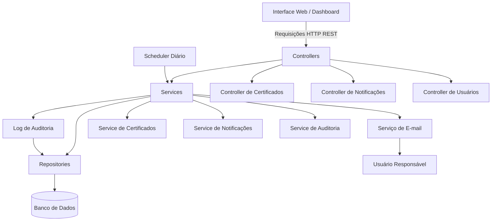
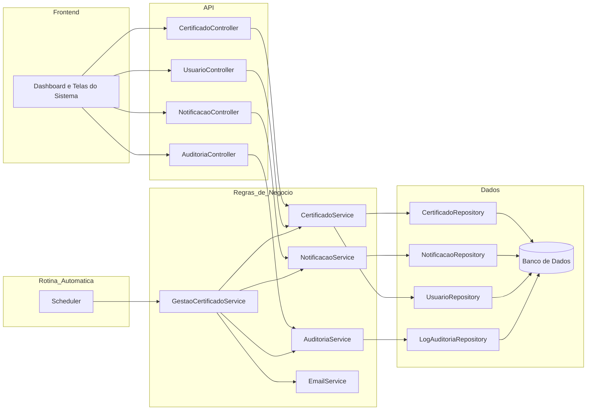

# Sprint 3: Definição da Arquitetura do Sistema

## 1. Resumo

Nesta etapa foi definida uma arquitetura simples para o sistema de monitoramento de vencimento de certificados.

A ideia é separar o que aparece para o usuário, o que recebe as requisições, o que executa as regras de negócio e o que acessa o banco de dados. Também entram na estrutura a rotina automática de verificação e o envio de e-mails.

## 2. Visão Geral da Arquitetura

O sistema será organizado em camadas, com comunicação REST entre a interface e a aplicação. A estrutura principal fica assim:

* **Camada de Apresentação:** telas do sistema, como dashboard de alertas e cadastro/consulta de certificados.
* **Camada Controller:** recebe as requisições HTTP e chama os serviços necessários.
* **Camada Service:** concentra as regras de negócio, como cálculo de vencimento, criação de notificações e registro de eventos.
* **Camada Repository:** faz a comunicação com o banco de dados.
* **Camada de Persistência:** armazena usuários, certificados, notificações e logs.
* **Serviços de Apoio:** executam tarefas específicas, como scheduler e envio de e-mail.

---

## 3. Representação da Estrutura

---

## 4. Responsabilidades por Camada

### 4.1. Camada de Apresentação

A camada de apresentação é a parte que o usuário acessa. Nela ficam o dashboard, a listagem de certificados, o cadastro de certificados e a tela de notificações.

**Responsabilidades:**
* Exibir certificados cadastrados.
* Exibir alertas ativos no dashboard.
* Permitir que o usuário visualize notificações.
* Enviar requisições para a API por meio de HTTP.
* Apresentar mensagens de sucesso, erro ou validação.

### 4.2. Camada Controller

A camada Controller é a entrada da aplicação. Ela recebe as requisições da interface, organiza os dados enviados e chama a camada Service.

**Responsabilidades:**
* Receber requisições REST.
* Validar dados obrigatórios da requisição.
* Encaminhar chamadas para a camada Service.
* Retornar respostas HTTP adequadas para a interface.
* Padronizar mensagens de erro e sucesso.

**Principais controllers:**
* `CertificadoController`
* `NotificacaoController`
* `UsuarioController`
* `AuditoriaController`

### 4.3. Camada Service

A camada Service guarda as regras principais do sistema. Nela acontece a verificação dos prazos, a decisão de criar alertas e o acionamento do envio de e-mail.

**Responsabilidades:**
* Calcular a quantidade de dias restantes para vencimento do certificado.
* Verificar se o certificado se enquadra nos prazos de alerta de 60, 30 ou 7 dias.
* Evitar notificações duplicadas para o mesmo certificado e prazo.
* Criar notificações no sistema.
* Solicitar envio de e-mail ao responsável.
* Registrar eventos e falhas em log de auditoria.

**Principais services:**
* `CertificadoService`
* `NotificacaoService`
* `GestaoCertificadoService`
* `AuditoriaService`
* `EmailService`

### 4.4. Camada Repository

A camada Repository separa o acesso ao banco de dados do restante da aplicação. Ela consulta, insere e atualiza registros, sem misturar regra de negócio.

**Responsabilidades:**
* Consultar certificados cadastrados.
* Buscar certificados próximos do vencimento.
* Persistir notificações geradas.
* Atualizar status de visualização das notificações.
* Registrar logs de auditoria.
* Buscar usuários responsáveis pelos certificados.

**Principais repositories:**
* `CertificadoRepository`
* `NotificacaoRepository`
* `UsuarioRepository`
* `LogAuditoriaRepository`

### 4.5. Camada de Persistência

A camada de persistência é o banco de dados. Ela guarda as tabelas usadas pelo sistema.

**Principais tabelas:**
* `USUARIO`
* `CERTIFICADO`
* `NOTIFICACAO`
* `LOG_AUDITORIA`

### 4.6. Serviços de Apoio

Os serviços de apoio fazem tarefas que não ficam diretamente na tela nem nos controllers.

**Scheduler:**
* Executa diariamente a rotina de verificação de certificados.
* Aciona o `GestaoCertificadoService`.
* Permite que a geração de alertas ocorra sem ação manual do usuário.

**Serviço de E-mail:**
* Recebe os dados da notificação e do usuário responsável.
* Envia o alerta por e-mail.
* Retorna sucesso ou falha para registro em auditoria.

---

## 5. Comunicação Entre Componentes

A comunicação entre interface e aplicação será feita por requisições HTTP no padrão REST. Os dados serão enviados e recebidos em JSON.

### 5.1. Fluxo de Consulta pelo Usuário

1. O usuário acessa o dashboard na interface.
2. A interface envia uma requisição `GET` para o controller de notificações.
3. O controller chama o service responsável.
4. O service consulta o repository.
5. O repository busca as notificações no banco de dados.
6. A resposta retorna para a interface em formato JSON.
7. O dashboard exibe os alertas ativos para o usuário.

### 5.2. Fluxo Automático de Verificação de Vencimento

1. O scheduler inicia a rotina diária de verificação.
2. O `GestaoCertificadoService` solicita ao repository a lista de certificados cadastrados.
3. O service calcula os dias restantes para vencimento de cada certificado.
4. Caso o certificado esteja nos prazos de 60, 30 ou 7 dias, o service verifica se já existe notificação para aquele prazo.
5. Se não houver duplicidade, o service cria uma nova notificação.
6. A notificação é persistida por meio do repository.
7. O `EmailService` envia o alerta ao usuário responsável.
8. O resultado da operação é registrado no log de auditoria.

### 5.3. Fluxo de Visualização de Notificação

1. O usuário visualiza uma notificação no dashboard.
2. A interface envia uma requisição `PATCH` para marcar a notificação como visualizada.
3. O controller encaminha a solicitação para o service.
4. O service atualiza o status da notificação.
5. O repository persiste a alteração no banco de dados.
6. O sistema registra o evento em log de auditoria.

---

## 6. Endpoints REST Previstos

| Método | Endpoint | Responsabilidade |
|---|---|---|
| `GET` | `/certificados` | Listar certificados cadastrados. |
| `POST` | `/certificados` | Cadastrar um novo certificado. |
| `GET` | `/certificados/{id}` | Consultar detalhes de um certificado. |
| `PUT` | `/certificados/{id}` | Atualizar dados de um certificado. |
| `GET` | `/notificacoes` | Listar notificações do usuário. |
| `PATCH` | `/notificacoes/{id}/visualizar` | Marcar uma notificação como visualizada. |
| `GET` | `/usuarios/{id}` | Consultar dados do usuário responsável. |
| `GET` | `/auditoria` | Consultar registros de auditoria. |

---

## 7. Diagrama de Componentes

---

## 8. Justificativa

A arquitetura em camadas foi escolhida por ser simples de entender e suficiente para o tamanho do sistema. Separar interface, controllers, services e repositories ajuda a manter cada parte com uma função clara.

Com essa divisão, as regras de negócio não ficam misturadas com tela ou acesso a dados. Assim, uma alteração no dashboard, no banco ou no envio dos alertas tende a afetar menos o restante do projeto.

O uso de REST facilita a comunicação entre frontend e backend e deixa o sistema mais fácil de adaptar no futuro. O scheduler fica responsável pela verificação diária, sem depender de uma ação manual do usuário.

O log de auditoria foi mantido para guardar o histórico das verificações, alertas gerados e falhas de envio.
