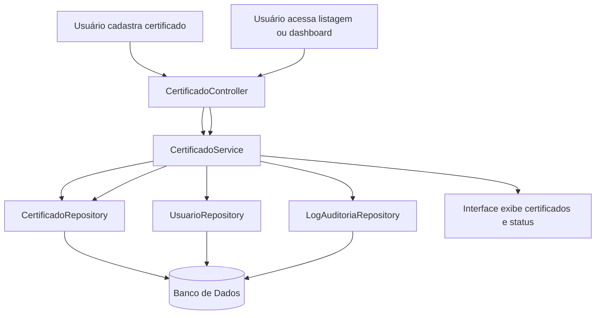

# Sprint 4: Organização, Integração e Planejamento do MVP

## 1. Resumo

Nesta sprint foi feita a conexão entre as classes identificadas nas etapas anteriores, a arquitetura definida para o sistema e o planejamento técnico da primeira versão funcional do projeto.

O MVP escolhido será a funcionalidade de **gerenciamento básico de certificados**. Essa escolha mantém o projeto alinhado ao objetivo central do Gestum, mas evita que a primeira versão dependa de automações mais complexas, como envio de e-mails, scheduler diário e alertas automáticos.

A proposta é implementar um fluxo funcional para cadastrar, consultar, editar, acompanhar status e visualizar informações importantes sobre certificados registrados no sistema. A partir dessa base, funcionalidades como alertas automáticos e envio de notificações poderão ser adicionadas em versões futuras.

---

## 2. Funcionalidade Principal do MVP

A funcionalidade principal do MVP será:

**Gerenciamento básico de certificados.**

O sistema deverá permitir que o usuário registre certificados e acompanhe suas informações principais, especialmente dados relacionados ao vencimento.

Essa funcionalidade poderá incluir:

* cadastro de certificados;
* consulta e listagem de certificados;
* edição de dados básicos;
* acompanhamento do status do certificado;
* visualização de certificados ativos, vencidos ou próximos do vencimento;
* relatório ou listagem simples de certificados por situação.

O foco do MVP será organizar os dados dos certificados e permitir uma visão inicial para acompanhamento. Os alertas automáticos ficam como evolução natural do sistema, mas não serão obrigatórios na primeira versão funcional.

---

## 3. Escopo do MVP

### 3.1. O que entra no MVP

O MVP incluirá as seguintes funcionalidades:

* Cadastro básico de certificados.
* Listagem de certificados cadastrados.
* Consulta dos detalhes de um certificado.
* Edição de informações básicas do certificado.
* Associação de um certificado a um usuário responsável.
* Controle manual ou calculado do status do certificado.
* Identificação visual de certificados ativos, vencidos e próximos do vencimento.
* Cálculo simples da quantidade de dias restantes para o vencimento.
* Dashboard simples com resumo dos certificados.
* Registro básico de alterações importantes em log de auditoria.

### 3.2. O que não entra no MVP

As seguintes funcionalidades ficarão fora da primeira versão:

* Alertas automáticos por scheduler.
* Envio de notificações por e-mail.
* Criação automática de notificações nos prazos de 60, 30 e 7 dias.
* Reenvio automático de e-mails com tentativas.
* Sistema completo de autenticação e permissões avançadas.
* Configuração personalizada dos prazos de alerta por usuário.
* Relatórios gerenciais completos.
* Histórico detalhado com filtros avançados.
* Integrações externas com outros sistemas.
* Gestão completa de perfis administrativos.

O objetivo do MVP é validar o fluxo principal de gerenciamento de certificados, mantendo o escopo simples, implementável e coerente com a arquitetura proposta.

---

## 4. Relação entre Classes e Arquitetura

A arquitetura definida anteriormente separa o sistema em camadas: apresentação, controllers, services, repositories, persistência e serviços de apoio. As classes identificadas nas sprints anteriores se encaixam nessa estrutura da seguinte forma:

| Classe | Camada ou componente | Responsabilidade no MVP |
|---|---|---|
| `Usuario` | Domínio / Persistência | Representa o responsável pelo certificado. |
| `Certificado` | Domínio / Persistência | Armazena os dados principais do certificado, incluindo emissão, vencimento e status. |
| `LogAuditoria` | Domínio / Persistência | Registra eventos importantes, como cadastro, edição e alteração de status. |
| `GestaoCertificado` | Service | Centraliza regras de negócio relacionadas ao gerenciamento e acompanhamento dos certificados. |
| `Notificacao` | Domínio / Persistência | Fica preparada para evolução futura com alertas, mas não é obrigatória no MVP. |
| `ServicoEmail` | Serviço de apoio | Fica fora do MVP e será usado futuramente para envio de alertas. |

Além dessas classes, a arquitetura prevê componentes técnicos para organizar a implementação:

| Componente | Camada | Papel |
|---|---|---|
| `CertificadoController` | Controller | Recebe requisições para cadastrar, listar, consultar e editar certificados. |
| `UsuarioController` | Controller | Permite consultar dados básicos do usuário responsável. |
| `AuditoriaController` | Controller | Permite consultar registros de auditoria, se necessário no MVP. |
| `CertificadoRepository` | Repository | Consulta e persiste certificados no banco de dados. |
| `UsuarioRepository` | Repository | Busca os dados do usuário responsável. |
| `LogAuditoriaRepository` | Repository | Persiste os registros de auditoria. |
| `NotificacaoController` | Controller | Fica reservado para versões futuras com alertas e notificações. |
| `NotificacaoRepository` | Repository | Fica reservado para versões futuras com alertas e notificações. |
| `Scheduler` | Serviço de apoio | Fica fora do MVP e poderá ser usado futuramente para automação. |

---

## 5. Fluxo Principal do Sistema

O fluxo principal do MVP começa com o cadastro de um certificado e termina com a consulta ou acompanhamento dele pelo usuário no sistema.

### 5.1. Entrada de dados

O usuário cadastra um certificado informando os dados principais:

* nome do certificado;
* descrição;
* data de emissão;
* data de vencimento;
* status;
* usuário responsável.

Esses dados são enviados pela interface para o `CertificadoController`, que valida as informações básicas e chama o `CertificadoService`. O service encaminha a persistência para o `CertificadoRepository`, que salva o registro no banco de dados.

### 5.2. Processamento

Após o cadastro, o `CertificadoService` aplica as regras básicas do MVP:

1. Valida se os campos obrigatórios foram preenchidos.
2. Confirma se a data de vencimento é válida.
3. Associa o certificado a um usuário responsável.
4. Calcula a quantidade de dias restantes até o vencimento.
5. Define ou atualiza o status do certificado.
6. Registra a operação em `LogAuditoria`.
7. Retorna os dados tratados para a interface.

No MVP, o status poderá ser controlado manualmente pelo usuário ou calculado de forma simples pelo sistema, por exemplo:

* `Ativo`: certificado ainda dentro do prazo.
* `Próximo do vencimento`: certificado com vencimento em prazo considerado curto.
* `Vencido`: certificado com data de vencimento já ultrapassada.

### 5.3. Resposta ao usuário

Quando o usuário acessar a listagem ou o dashboard, a interface fará uma requisição ao `CertificadoController`.

O controller chamará o `CertificadoService`, que buscará os registros no `CertificadoRepository`. A resposta será enviada em formato JSON para a interface, que exibirá os certificados cadastrados e seus respectivos status.

Caso o usuário edite um certificado ou altere seu status, o sistema atualizará o registro no banco de dados e poderá registrar o evento em `LogAuditoria`.

---

## 6. Fluxo Técnico do MVP

---

## 7. Planejamento Técnico da Implementação

### 7.1. Camada de Apresentação

A interface do MVP terá telas simples para:

* cadastrar certificados;
* listar certificados;
* consultar detalhes de um certificado;
* editar dados básicos;
* alterar ou visualizar o status;
* visualizar um dashboard simples com resumo dos certificados.

A interface se comunicará com a aplicação por requisições HTTP REST, recebendo e enviando dados em JSON.

### 7.2. Camada Controller

Os controllers serão responsáveis por receber as requisições da interface e acionar os services corretos.

Endpoints previstos para o MVP:

| Método | Endpoint | Responsabilidade |
|---|---|---|
| `POST` | `/certificados` | Cadastrar certificado. |
| `GET` | `/certificados` | Listar certificados. |
| `GET` | `/certificados/{id}` | Consultar detalhes de um certificado. |
| `PUT` | `/certificados/{id}` | Atualizar dados de um certificado. |
| `PATCH` | `/certificados/{id}/status` | Atualizar o status de um certificado. |
| `GET` | `/certificados/resumo` | Consultar resumo para dashboard. |

Esses endpoints são suficientes para validar o gerenciamento básico de certificados sem exigir automações externas.

### 7.3. Camada Service

A camada service concentrará a regra de negócio.

O `CertificadoService` será o principal service do MVP. Ele deverá:

* cadastrar certificados;
* listar certificados;
* consultar certificado por identificador;
* validar dados obrigatórios;
* calcular dias até o vencimento;
* definir ou atualizar status;
* organizar os dados de resumo para o dashboard;
* registrar alterações importantes em auditoria.

O `GestaoCertificadoService` poderá apoiar regras mais gerais de gerenciamento, como classificação de status e identificação de certificados próximos do vencimento.

O `UsuarioService`, caso seja necessário, ficará responsável por buscar ou validar o usuário responsável pelo certificado.

### 7.4. Camada Repository

Os repositories farão a comunicação com o banco de dados.

Principais operações previstas:

* `CertificadoRepository.buscarTodos()`
* `CertificadoRepository.buscarPorId(idCertificado)`
* `CertificadoRepository.salvar(certificado)`
* `CertificadoRepository.atualizar(certificado)`
* `CertificadoRepository.atualizarStatus(idCertificado, status)`
* `CertificadoRepository.buscarResumo()`
* `UsuarioRepository.buscarPorId(idUsuario)`
* `LogAuditoriaRepository.salvar(log)`

Essa separação evita que os services dependam diretamente de comandos de banco de dados.

### 7.5. Dashboard simples

O dashboard do MVP deverá apresentar uma visão resumida dos certificados cadastrados.

Informações previstas:

* total de certificados;
* quantidade de certificados ativos;
* quantidade de certificados próximos do vencimento;
* quantidade de certificados vencidos;
* lista dos certificados com vencimento mais próximo.

Esse dashboard não precisa gerar notificações automáticas. Ele serve como uma primeira forma de acompanhamento visual.

### 7.6. Funcionalidades futuras

Depois que o gerenciamento básico estiver funcional, o sistema poderá evoluir para:

* criação automática de notificações;
* alertas nos prazos de 60, 30 e 7 dias;
* envio de e-mails;
* scheduler diário;
* histórico avançado de auditoria;
* configurações personalizadas por usuário.

---

## 8. Integração entre os Componentes

A integração principal do MVP ocorrerá da seguinte forma:

1. A interface envia dados para o `CertificadoController`.
2. O controller valida a entrada e chama o `CertificadoService`.
3. O service aplica as regras de negócio do gerenciamento de certificados.
4. O service consulta o `UsuarioRepository` quando precisa validar o responsável.
5. O `CertificadoRepository` faz leitura e escrita no banco de dados.
6. O `LogAuditoriaRepository` registra operações relevantes.
7. A interface consulta os certificados e exibe a listagem ou o dashboard.

Essa organização mantém a arquitetura em camadas e garante que cada componente tenha uma responsabilidade clara.

---

## 9. Regras de Negócio Aplicadas no MVP

As principais regras de negócio consideradas no MVP serão:

* Todo certificado deve possuir nome e data de vencimento.
* Todo certificado deve possuir um usuário responsável.
* A data de vencimento deve ser igual ou posterior à data de emissão.
* O sistema deve permitir consultar certificados cadastrados.
* O sistema deve permitir editar informações básicas do certificado.
* O status do certificado deve indicar sua situação atual.
* Certificados vencidos devem permanecer cadastrados e rastreáveis.
* Alterações importantes devem gerar registro em log de auditoria.

---

## 10. Critérios de Validação do MVP

O MVP será considerado funcional quando:

* for possível cadastrar um certificado com seus dados principais;
* for possível associar o certificado a um usuário responsável;
* for possível listar os certificados cadastrados;
* for possível consultar os detalhes de um certificado;
* for possível editar dados básicos do certificado;
* for possível acompanhar o status do certificado;
* o dashboard exibir um resumo simples dos certificados;
* alterações importantes forem registradas em log de auditoria.

---

## 11. Conclusão

A Sprint 4 organiza o planejamento técnico do MVP conectando os requisitos, as classes, a arquitetura e o fluxo principal do sistema.

O MVP será concentrado no **gerenciamento básico de certificados**, pois essa funcionalidade cria a base necessária para todas as próximas etapas do Gestum. A implementação será dividida em camadas, respeitando a separação entre interface, controllers, services, repositories, persistência e serviços de apoio.

Com esse planejamento, o grupo passa a ter uma visão clara de quais partes do sistema serão utilizadas na primeira versão funcional e como os componentes irão trabalhar juntos. As funcionalidades de alerta automático, scheduler e envio de e-mail permanecem previstas como evolução do sistema, mas não são obrigatórias para a primeira entrega.
